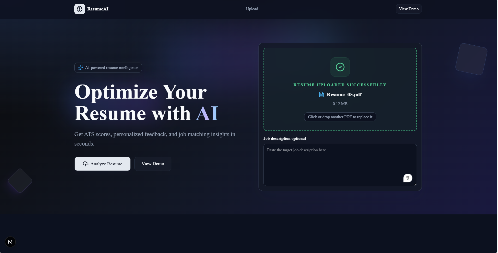
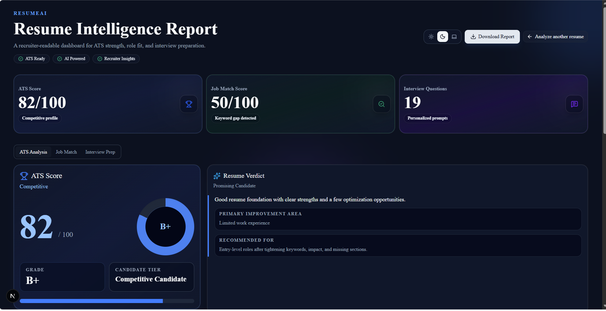
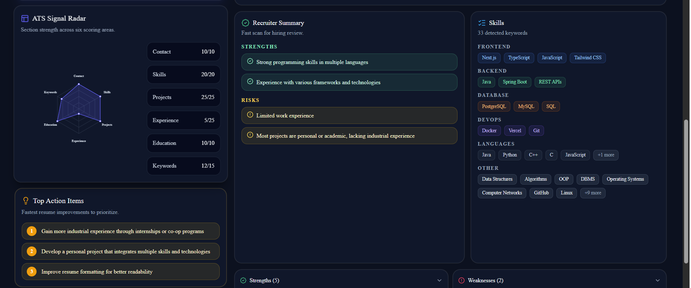
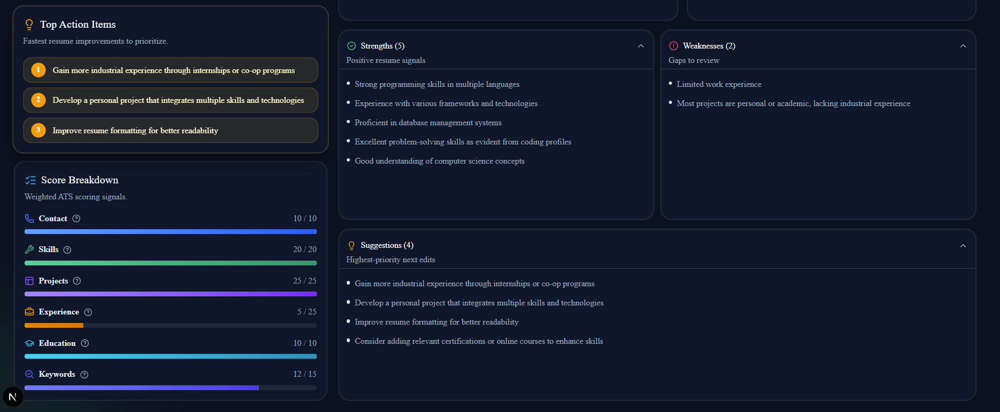
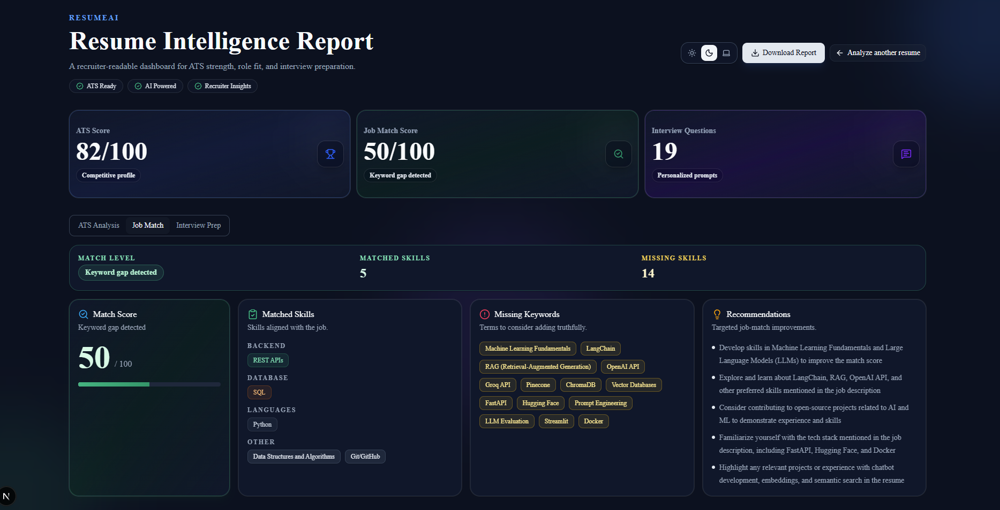
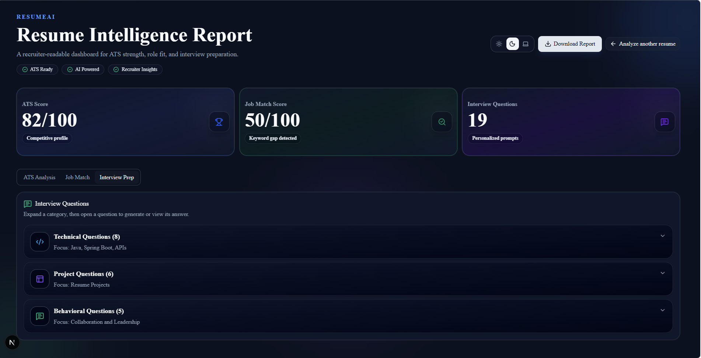
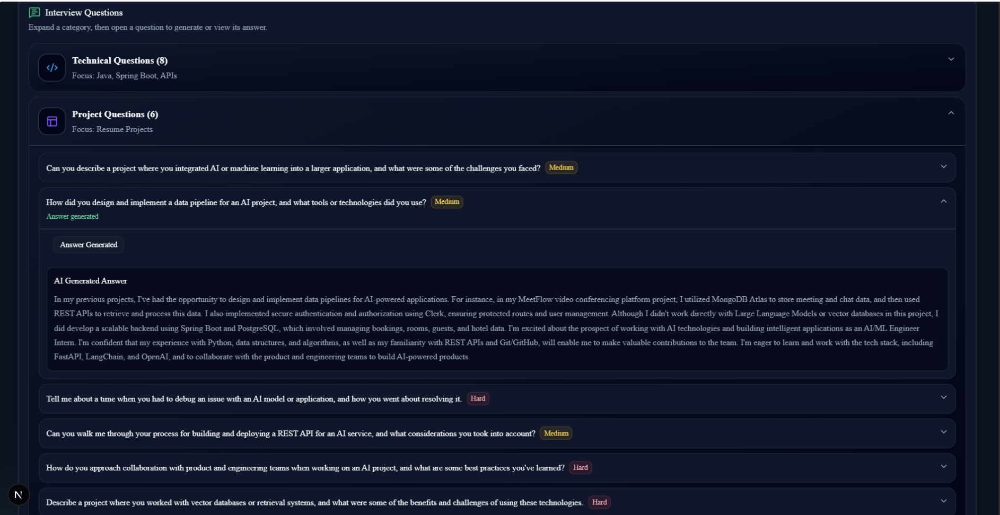

# 🚀 ResumeAI - AI-Powered Resume Intelligence Platform

Transform resumes into actionable career insights with ATS scoring, job-match analysis, recruiter feedback, and AI-generated interview preparation.


---

## 🌐 Live Demo

🔗 **Live Application:** https://ai-resume-analyzer-tau-seven-73.vercel.app

📂 **GitHub Repository:** https://github.com/navalmishra/AI-Resume-Analyzer

---

## ✨ Overview

ResumeAI is an intelligent resume analysis platform that helps job seekers evaluate and improve their resumes using AI-powered insights.

Users can upload a resume, optionally provide a job description, and receive:

- ATS Compatibility Score
- Job Match Analysis
- Skill Gap Detection
- Recruiter Insights
- Resume Strengths & Weaknesses
- Personalized Recommendations
- AI-Generated Interview Questions

Designed with a recruiter-first approach, ResumeAI provides a professional dashboard that converts raw resume data into meaningful hiring insights.

---

## 🎯 Features

### 📊 ATS Analysis

- ATS Score Calculation
- Resume Quality Assessment
- Section-wise Score Breakdown
- ATS Signal Radar Visualization
- Resume Verdict Generation
- Recruiter Summary

### 🎯 Job Match Analysis

Compare resumes against specific job descriptions.

- Job Match Score
- Missing Keywords Detection
- Skill Gap Analysis
- Matched Skills Identification
- Personalized Improvement Recommendations

### 🎤 AI Interview Preparation

Generate interview questions directly from the resume.

Categories include:

- Technical Questions
- Project-Based Questions
- Behavioral Questions

---

### 📈 Recruiter Insights Dashboard

Provides recruiter-friendly insights including:

- Strengths
- Weaknesses
- Action Items
- Candidate Tier Classification
- Skill Categorization

---

### 📑 Professional PDF Reports

* One-click report generation
* Download complete resume analysis as PDF
* Shareable recruiter-friendly reports
* Includes ATS score, job match insights, recommendations, and interview preparation

---

### 🌙 Dark Mode Support

- Light Theme
- Dark Theme
- System Theme Detection

Fully responsive across desktop, tablet, and mobile devices.

---

## 🖥️ Screenshots

### Landing Page



### ATS Analysis Dashboard








### Job Match Analysis



### Interview Preparation





---

## 🛠️ Tech Stack

### Frontend

- Next.js 15
- React
- TypeScript
- Tailwind CSS
- Shadcn UI
- Lucide React

### Backend

- Next.js API Routes
- Groq AI API

### Database

- PostgreSQL
- Prisma ORM

### Authentication

- Clerk Authentication

### File Processing

- PDF Parsing
- Resume Text Extraction

### Deployment

- Vercel

---

## 🏗️ System Architecture

```text
Resume Upload
      │
      ▼
PDF Parser
      │
      ▼
Resume Extraction
      │
      ▼
Groq AI Analysis
      │
 ┌────┼───────────┐
 ▼    ▼           ▼
ATS  Job Match  Interview Questions
 │      │            │
 └──────┴────────────┘
            ▼
     Analytics Dashboard
```

---

## 🚀 Getting Started

### Clone Repository

```bash
git clone https://github.com/navalmishra/AI-Resume-Analyzer.git

cd AI-Resume-Analyzer
```

### Install Dependencies

```bash
npm install
```

### Configure Environment Variables

Create a `.env.local` file:

```env
DATABASE_URL=
GROQ_API_KEY=
NEXT_PUBLIC_CLERK_PUBLISHABLE_KEY=
CLERK_SECRET_KEY=
```

### Run Development Server

```bash
npm run dev
```

Visit:

```text
http://localhost:3000
```

---

## 📂 Project Structure

```text
src/
├── app/
├── components/
│   ├── dashboard/
│   ├── upload/
│   ├── charts/
│   └── ui/
├── lib/
├── actions/
├── hooks/
├── types/
└── utils/
```

---

## 💡 Key Highlights

- AI-Powered Resume Evaluation
- Real-Time ATS Analysis
- Job Description Matching
- Recruiter-Centric Dashboard
- Interactive Radar Charts
- Dark Mode Support
- Responsive SaaS Design
- Production Deployment

---

## 📈 Future Enhancements

- Resume Rewrite Suggestions
- Cover Letter Generator
- Multi-Resume Comparison
- Industry-Specific ATS Models
- Resume Version History
- AI Career Roadmaps

---

## 👨‍💻 Author

### Naval Chandra Mishra

B.Tech CSE, IIIT Agartala

- GitHub: https://github.com/navalmishra
- LinkedIn:https://www.linkedin.com/in/naval-chandra-mishra/
- LeetCode: https://leetcode.com/u/navalmishra5347/

---

## ⭐ Support

If you found this project useful:

⭐ Star the repository

🍴 Fork the repository

🚀 Share it with others
